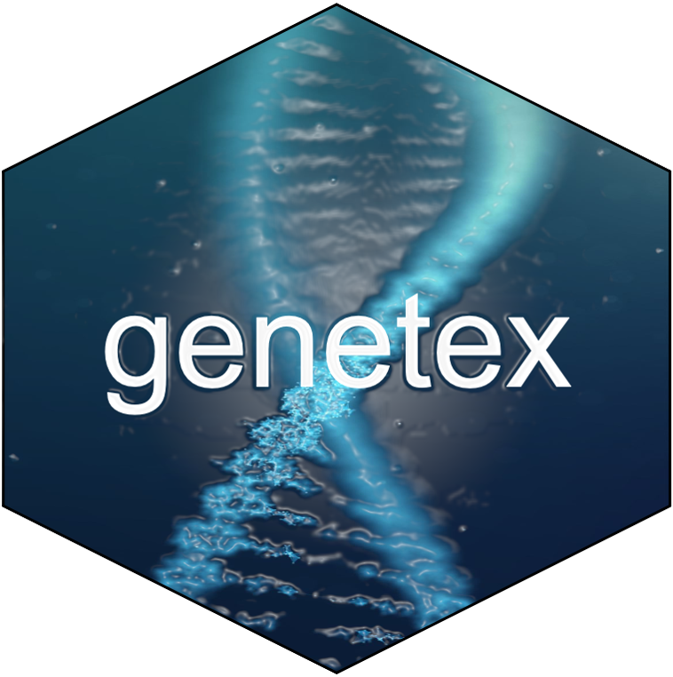

<!-- README.md is generated from README.Rmd. Please edit that file -->

```{r, include = FALSE}
knitr::opts_chunk$set(
  collapse = TRUE,
  comment = "#>",
  fig.path = "man/figures/README-",
  out.width = "100%"
)
library(tidyverse)
library(mlab)
library(knitr)
library(kableExtra)
```



<!-- badges: start -->
<!-- badges: end -->

## Overview  
The goal of <font color = 'orange' ><b>GENETEX</b></font> (pronounced "genetics") is to facilitate data abstraction from genomic reports for clinical research. With that goal in mind, the package centralizes around a core function called `genetex_to_redcap()` which applies natural language and text mining tools to abstract key genomic information from a variety of clinical reports found in routine clinical practice and prepares those data for import into a REDCap<sup>&#174;</sup> database.  


<font color = 'orange' ><b>GENETEX</b></font> provides a set of verbs that help you import, text mine and process genomic data for clinical research:
```{r Table 1 - GENETEX Verbs, echo=FALSE, message=FALSE, warning=FALSE}
verbs <- dplyr::tribble(
  ~verbs, ~`function`,
  #------,#----------,
  "genetex_to_redcap()", "integrates key verbs to provide NLP tools to abstract data from a variety of genomic reports and import them to REDCap",
  "gene.variants()","integrates various platform-specific NLP functions to text mine gene names and nucleotide variants from genomic reports and transforms them to structured data for import into REDCap",
  "cnv()","integrates various platform-specific NLP functions to text mine gene names and copy number variants data from a variety of genomic reports and transforms them to structured data for import into REDCap",
  "mmr()","text mines mismatch repair status from genomic reports and transforms it to structured data for import into REDCap",
  "mutational.signatures()","text mines mutational signatures data from a variety of genomic reports and transforms it to structured data for import into REDCap",
  "tmb()","text mines tumor mutation burden (TMB) data from a variety of genomic reports and transforms it to structured data for import into REDCap",
  "platform()","applies regular expressions to assign a numerical value for the various platforms used for genomic reports that aligns with the `genomics_platform` field in the REDCap Genomics Instrument",
  "genes_regex()","produces a regular expression of over 900 HGNC gene names",
  "genes_boundary_regex()","produces a regular expression of over 900 HGNC gene names as a unique string with word boundaries",
  "genomics.tissue.type()","applies regular expressions to assign a numerical value for the various platforms used for genomic reports that aligns with the  `genomics_platform` field in the REDCap Genomics Instrument"
)
verbs %>% dmmFUNCTIONS::dmm.table()

verbs %>% 
  kable() %>% 
  kable_styling(font_size = 12) %>% 
  save_kable("./manuscript/figs/verbs.pdf", self_contained = FALSE)
```
## Dependencies
### Software Dependencies
<font color = 'orange' ><b>GENETEX</b></font> is written in R (version 4.0.0), organized using roxygen2[@RN2722], and utilizes the following packages dplyr[@RN2730], tidyr[@RN2724], readr[@RN2725], stringr[@RN2726], purrr[@RN2727], REDCapR[@RN2728], magrittr[@RN2729], splitstackshape[@RN2731] and Shiny[@RN2723].

### Clinical Informatics Dependencies
The purpose of this package is to facilitate abstraction of medical records for importation into the ***Genomics Instrument*** in REDCap<sup>&#174;</sup>. Therefore you must have a REDCap<sup>&#174;</sup> project and the ***Genomics Instrument***. The data dictionary of the Genomics Instrument, has been previously published and can be found **[here](https://www.themillerlab.io/post/optimizing_rwd_collection-clinical_genomics/)**. 

## Installation

### Development version

To get a bug fix or to use a feature from the development version, you can install 
the development version of <font color = 'orange' ><b>GENETEX</b></font> from GitHub.

```{r, eval = FALSE}
# install.packages("devtools")
devtools::install_github("TheMillerLab/genetex")
```

## Usage

```{r, message = FALSE, warning=FALSE}
library(genetex)
```

### Input  
Ideally the input data is directly copied to your computer's clipboard from the clinical report by "selecting all" and then "copy". That is the default. We wanted to make this function as user-friendly to busy clinicians and clinical research staff. Since most staff will have the report open in a window in their Electronic Health Record or an open PDF form a commercial vendor, we designed <font color = 'orange' ><b>GENETEX</b></font> to take advantage of the `readr::clipboard()` function. If you don't use the clipboard function, you can use a data frame of the text file. That data frame can be engineered from a txt or csv file. Each line of the data frame should mirror a line in the genomics report.

In addition, to ease abstraction of these data, we created a browser-based user interface that incorporates text data captured on a clipboard as input in a Shiny application. This Shiny app is separate, but complementary to the GENETEX package. Text is copied to a computer's clipboard and pasted into the text area input in the Shiny application

#### Supported Platforms  
At this time, reports from the following platforms are able to be processed by <font color = 'orange' ><b>genetex</b></font>:  

* [Gaurdant Health](https://guardanthealth.com)  
* [FoundationOne](https://www.foundationmedicine.co.uk)  
* [MGH SNaPshot](https://www.massgeneral.org/pathology/services/center-for-integrated-diagnostics-default)  
* [BWH Oncopanel](https://www.brighamandwomens.org/pathology/center-for-advanced-molecular-diagnostics/molecular-diagnostics-laboratory)  

### Example of text mining various clinical genomic reports  
***<u>Of note, these clinical data are completely synthetic and do not represent any actual patient-related. Any relation to an actual patients is purely coincidental</u>.***  

#### Guardant Health Report
```{r, message = FALSE, warning=FALSE}
genetex::guardant_sample_report_Lewis_Jones_prostate %>% 
 genetex::genetex_to_redcap(
   record_id = "Lewis Jones",
   instrument_instance = 1,
   genomics_tissue_type = "Blood",
   platform = "guardant",
   date_collected = "2021-01-01",
   lesion_tag = "Liquid Biopsy"
   ) %>% 
   dmmFUNCTIONS::dmm.table()

```

##### Output  
- The output of this function will be a csv file stored in the "./file" subfolder in your working directory.  
- The above output is just a "glimpse" that is provided to provide instant feed back to the end user that the function called without error
- The csv file be entitled: "guardant_import_Lewis Jones.csv" since the record was titled "Lewis Jones".  
- This csv file can then be imported into REDCap<sup>&#174;</sup>.  
- Alternatively, if you have a REDCap<sup>&#174;</sup> API, you can directly import the data into your REDCap<sup>&#174;</sup> project with the argument redcap_api_token, and along with the url assigned to the argument redcap_uri. 
- Alternatively you can use the Shiny App.

#### MGH SNaPshot Report
```{r, message = FALSE, warning=FALSE}
genetex::snapshot_sample_report %>% 
   genetex::genetex_to_redcap(
   record_id = "Jane Doe",
   instrument_instance = 1,
   genomics_tissue_type = "Primary Cutaneous Lesion",
   platform = "mgh",
   date_collected = "2021-01-01",
   lesion_tag = "Right Arm Primary Lesion",
   ) %>% 
   dmmFUNCTIONS::dmm.table()

```


##### Direct Import into REDCap<sup>&#174;</sup>
- If you used the redcap_uri and redcap_api_token arguments and directly imported your data into the Genomics instrument. 


#### BWH Oncopanel Report
```{r, message = FALSE, warning=FALSE}
genetex::oncopanel_sample_report %>% 
   genetex::genetex_to_redcap(
      record_id = "John Doe",
      instrument_instance = 1,
      date_collected = "2021-01-01",
      platform = "bwh",
      lesion_tag = "Right Arm Primary Lesion",
      genomics_tissue_type = "pct"
   ) %>% 
   dmmFUNCTIONS::dmm.table()

```


### Other Functions
We've incorporated a few other functions with the goal of facilitating analysis of genomics data  

#### genes_regex()
`genes_regex()` returns a regex of cancer gene symbols, which can be used to assist in text mining data by matching a list of 906 cancer-related genes
```{r, message=FALSE, warning=FALSE}
genetex::genes_regex()
```

## Getting help

If you encounter a clear bug, please file an issue with a minimal reproducible example on [GitHub](https://github.com/TheMillerLab/genetex/issues).

## Disclaimer and Acknoledgements
We would like to acknowledge Ravikumar Komandur, PhD, Project Director at Project Data Sphere for review and critique of the manuscript; Guardant Health and Foundation Medicine for making sample reports available for the development of this package. <font color = 'orange' ><b>GENETEX</b></font> is for research purposes only. No clinical decisions should be made with the information obtained from its output. This article reflects the views and work (including development and use of <font color = 'orange' ><b>GENETEX</b></font>) of the authors and should not be construed to represent the work, policies, of any of the vendors whose reports were used to develop <font color = 'orange' ><b>GENETEX</b></font> and whose reports may be provided as part of the package. This package reflects the views of the authors and should not be construed to represent the views or policies of any of the vendors that have supplied sample reports to the package.

# Bibliography
